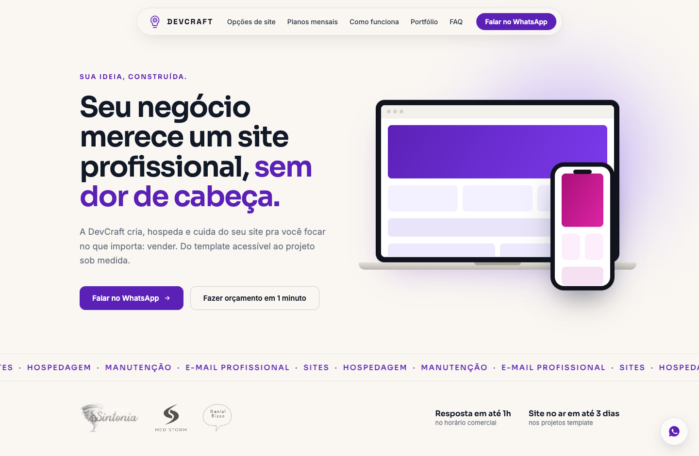
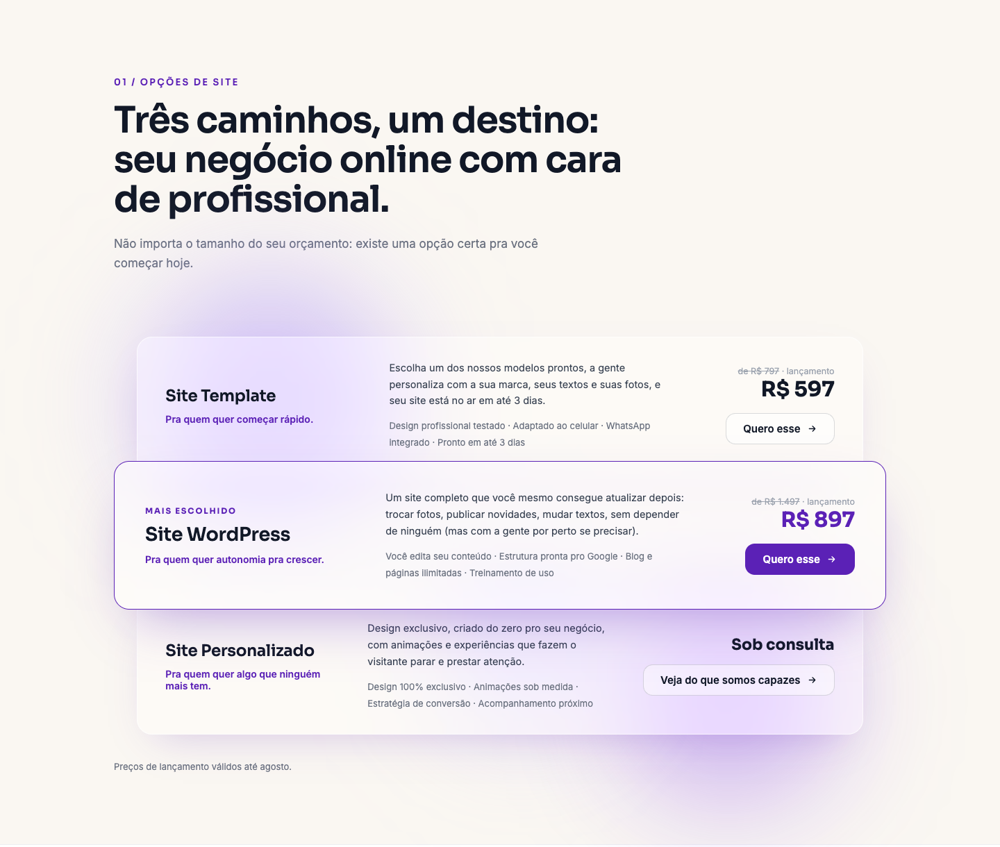
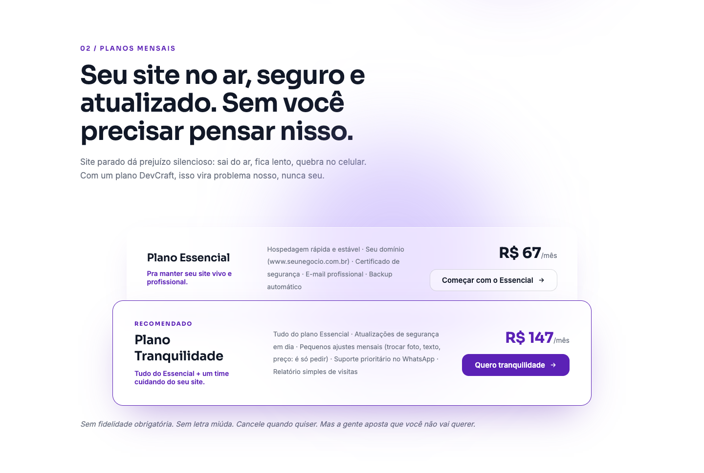
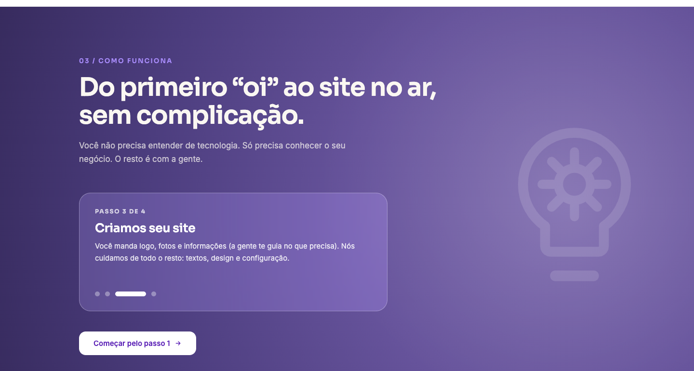
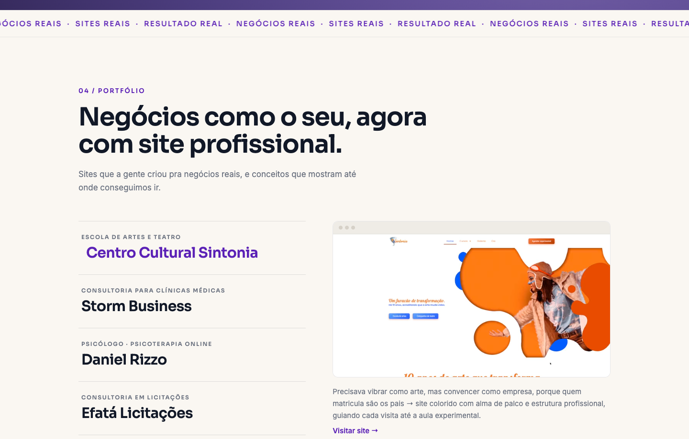
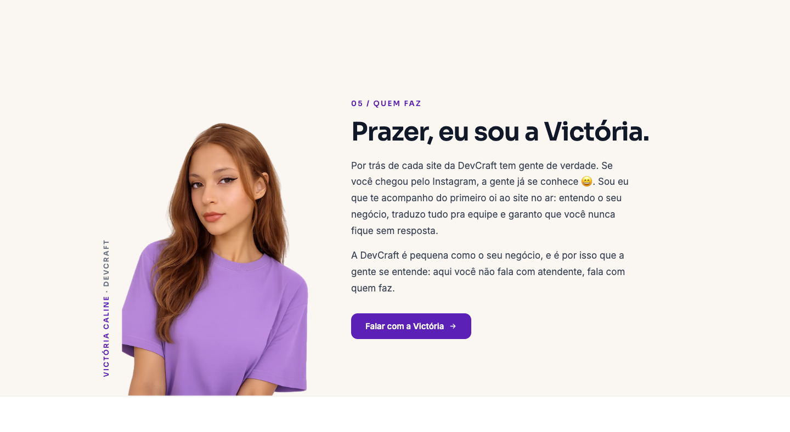
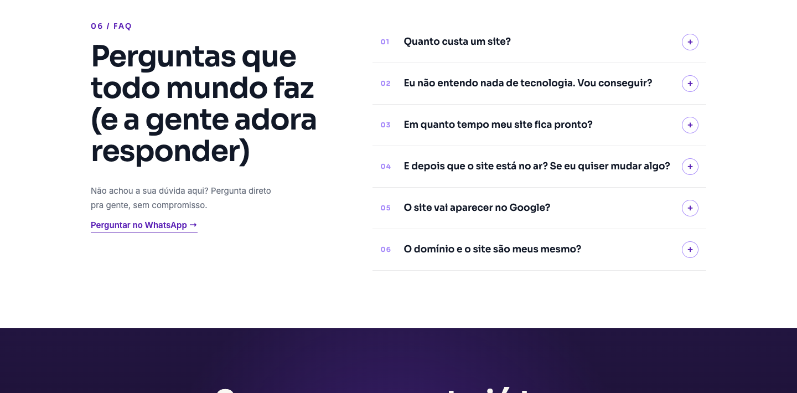
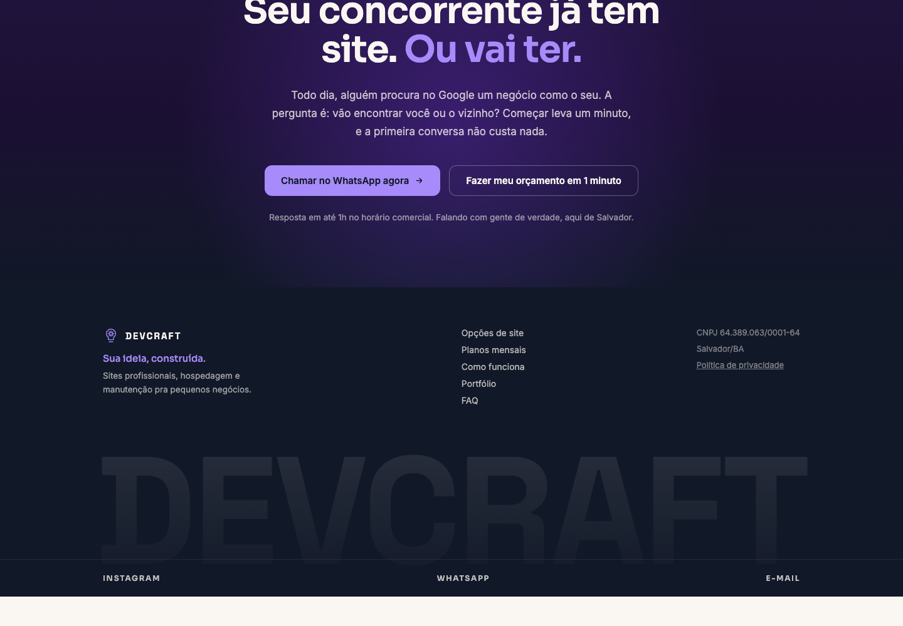
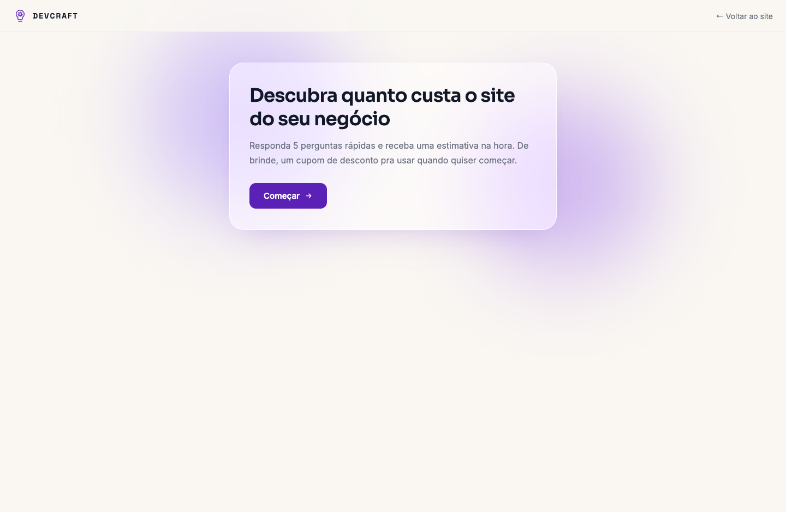
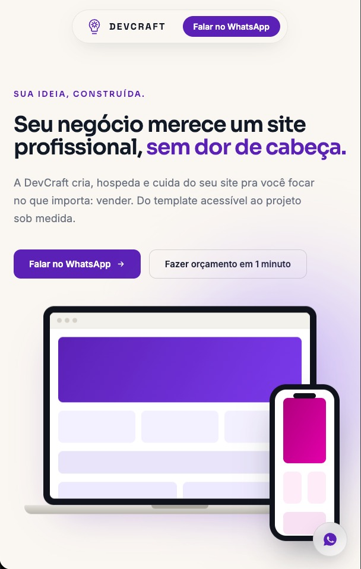

# DevCraft 🟣

**Sua ideia, construída.**

Site comercial da [DevCraft](https://devcraft.dev.br), agência de criação de sites de Salvador/BA. One-page de conversão + quiz de orçamento + captura automática de leads.

### 🔗 [devcraft.dev.br](https://devcraft.dev.br)

> Este repositório é a vitrine do projeto: prints e visão geral. O código-fonte é privado.

---

## O projeto

A DevCraft cria, hospeda e cuida de sites pra pequenos negócios. O site foi desenhado pra um funil simples: a visita chega (principalmente pelo Instagram), entende as opções em uma página só e conversa no WhatsApp — ou responde um quiz de 1 minuto e recebe uma estimativa na hora, com cupom de desconto.

**Como o funil funciona:**

1. **One-page** apresenta opções de site, planos mensais, processo, portfólio e FAQ
2. **Quiz de orçamento** (5 perguntas) calcula uma recomendação personalizada de produto + plano
3. O lead cai automaticamente numa **planilha Google** e dispara um **alerta por e-mail**, com marcação de urgência 🔥
4. A página de obrigado entrega a estimativa + **cupom de desconto** e leva a conversa pro WhatsApp
5. Cada botão de WhatsApp do site tem **mensagem própria**, revelando em que ponto do funil o cliente estava quando clicou

## Destaques

- **Design system próprio**: paleta roxa da marca, tipografia Sora/Inter/Space Grotesk, elementos liquid glass, microinterações e efeito "lanterna" no rodapé
- **Portfólio vivo**: screen-captures reais dos sites dos clientes rodando em loop (mp4 otimizados a ≤1MB, lazy loading, poster de fallback e respeito a `prefers-reduced-motion`)
- **Captura de leads resiliente**: falha de integração nunca bloqueia o usuário
- **LGPD**: política de privacidade completa, dados mínimos e canal de exclusão
- **SEO**: FAQ com dados estruturados (JSON-LD), sitemap, Open Graph pra prévia bonita no WhatsApp

## Telas

### Hero

### Opções de site

### Planos mensais

### Como funciona

### Portfólio (sites reais em vídeo)

### Quem faz

### FAQ

### CTA final + rodapé

### Quiz de orçamento

### Mobile

## Stack

- **Next.js 15** (App Router) · **React 19**
- CSS próprio, sem frameworks
- Deploy na **Vercel** com domínio próprio
- Integrações: **Google Sheets** (Apps Script) e **Resend** (alertas de lead por e-mail)

---

Feito com 💜 pela DevCraft · [Instagram](https://instagram.com/devcraft.br) · contato@devcraft.dev.br
